# xSpeedTest

A modern Qt 6 / QML speed test for KDE Plasma. It measures download, upload, ping and jitter with a live animated stream, follows your system theme, blurs and tints through KWin, and ships a Plasma 6 widget for the desktop and the panel.

<p align="center">
  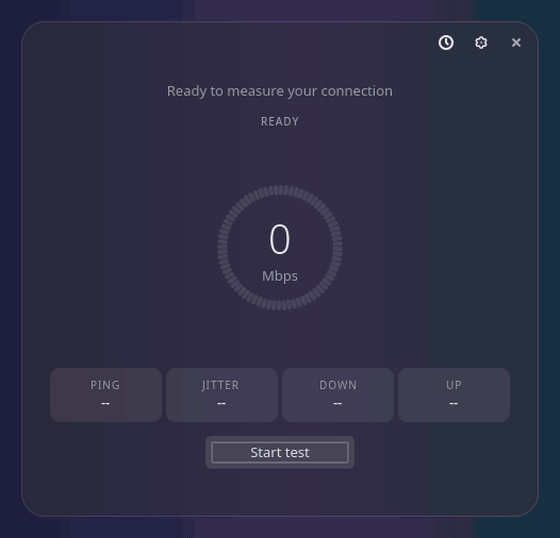<br>
  <sub>The app mid-test with a randomly picked style (Dual Orb). Every style is listed in the <a href="#styles">gallery</a> below.</sub>
</p>

## Features

- **Live animation.** The stream, gauge or chart reacts to your real throughput while the test runs.
- **Accurate numbers.** Parallel HTTPS transfers with the TCP ramp-up excluded, so a 300 Mbps line reads about 300 Mbps.
- **Closest, fastest server.** Candidates from the speedtest-cli server list plus Cloudflare are ranked by latency and reliability, then the near-best ones get a short throughput probe.
- **35 styles.** Dark, full-width designs from arcs and dials to spectrum bars, with one palette per style.
- **Native look.** Colors, fonts and controls come from the system theme (Kirigami, Qt style, Kvantum). The window uses KWin blur and adjustable transparency.
- **Plasma widget.** One widget for the desktop and the panel, installed and updated from inside the app.
- **Separate settings.** The app and the widget keep their own settings.

## Settings

Open the settings page with the cog next to the close button. Every option is staged: nothing changes until you press **Apply**, and Apply is only enabled when something differs.

<p align="center">
  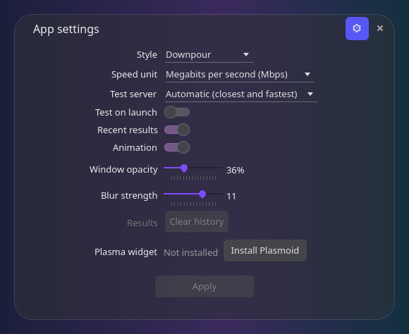
</p>

| Setting | What it does |
|---|---|
| Style | Picks one of the 35 designs below. |
| Speed unit | Mbps, kbps, MBps or KBps. Applies to the readout, the stat boxes, history and tooltips. |
| Test server | Automatic (closest and fastest), speedtest-cli servers only, or Cloudflare only. |
| Test on launch | Starts a test as soon as the app opens. |
| Recent results | Shows the last results under the test. |
| Animation | Turns the stream animation on or off. |
| Window opacity | Opacity of the window surface, 10 to 100 percent (default 36). |
| Blur strength | KWin blur strength from 1 to 15. This is a global KWin setting, so it changes the blur of every window on your desktop. |
| Clear history | Deletes the saved results (the last 50 are kept). |
| Plasma widget | Install the widget, or update it when a newer version is bundled with the app. |

The app stores its settings in `~/.config/xspeedtest/app.conf` and the widget in `~/.config/xspeedtest/plasmoid.conf`. Results history is shared.

## Plasma widget

<p align="center">
  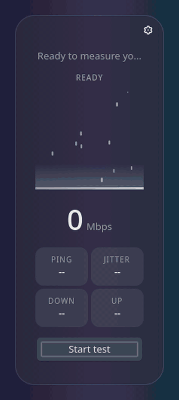
</p>

- On the **desktop** the widget shows the full layout of the selected style on its own translucent surface.
- In the **panel** it is an icon with a tooltip of the last result. Click it for the compact popup shown above.
- The cog in the widget opens the widget's own settings page.

Install it from the app: open the settings and press **Install Plasmoid**, then add xSpeedTest from Add Widgets. When the app bundles a newer widget, the button becomes **Update Plasmoid**. An update restarts the Plasma shell so the new widget loads, and your panels and desktop reload for a few seconds.

## Install

Arch Linux with KDE Plasma 6:

```sh
cd packaging
makepkg -si
```

The package depends on `qt6-base`, `qt6-declarative`, `kirigami`, `qqc2-desktop-style`, `kwindowsystem`, `libplasma`, `python` and `speedtest-cli`. Then start **xSpeedTest** from the launcher or run `xspeedtest`.

Build and test from a checkout:

```sh
cmake -S . -B build -G Ninja
cmake --build build
QT_QPA_PLATFORM=offscreen ctest --test-dir build
./build/bin/xspeedtest
```

## How it measures

speedtest-cli 2.1.3 under-reports on fast lines, and its server list is now only ten servers. xSpeedTest keeps the speedtest module for discovery and runs its own transfers:

1. Every candidate server is pinged eight times over one keep-alive connection. Servers that fail or answer unreliably are dropped.
2. The candidates within about twice the best latency get a 2.5 second download probe. The closest one that reaches at least 85 percent of the fastest probe wins.
3. Download and upload each run four parallel connections for 8 seconds. The result is the byte rate after a 2.5 second warm-up, so TCP slow start does not drag it down.

`XSPEEDTEST_BACKEND=speedtest|cloudflare|auto` restricts the server pool. The same option is in the settings.

## Styles

Click any preview to open it full size.

| Style | Preview | Style | Preview |
|---|:---:|---|:---:|
| **Downpour**<br><sub>Wide</sub> | <a href="docs/media/full/downpour.gif">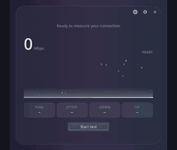</a> | **Aurora Arc**<br><sub>Center</sub> | <a href="docs/media/full/aurora-arc.gif">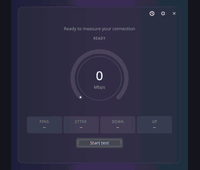</a> |
| **Northern Ring**<br><sub>Center</sub> | <a href="docs/media/full/northern-ring.gif">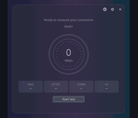</a> | **Redline Tach**<br><sub>Center</sub> | <a href="docs/media/full/redline-tach.gif">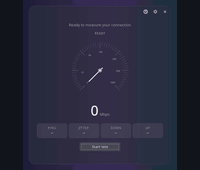</a> |
| **Frost Needle**<br><sub>Split</sub> | <a href="docs/media/full/frost-needle.gif">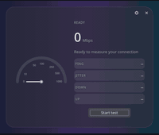</a> | **Glass Bar**<br><sub>Minimal</sub> | <a href="docs/media/full/glass-bar.gif">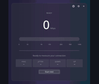</a> |
| **Spectrum Deck**<br><sub>Wide</sub> | <a href="docs/media/full/spectrum-deck.gif">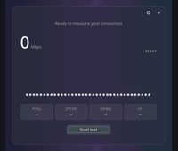</a> | **Live Trace**<br><sub>Wide</sub> | <a href="docs/media/full/live-trace.gif">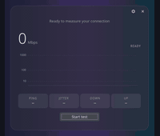</a> |
| **Orbit Lab**<br><sub>Center</sub> | <a href="docs/media/full/orbit-lab.gif">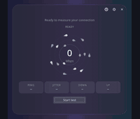</a> | **Lava Orb**<br><sub>Center</sub> | <a href="docs/media/full/lava-orb.gif">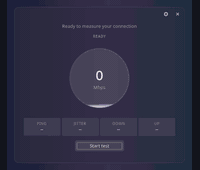</a> |
| **LED Halo**<br><sub>Center</sub> | <a href="docs/media/full/led-halo.gif">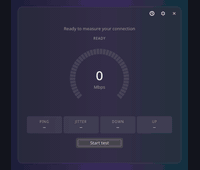</a> | **Twin Rings**<br><sub>Center</sub> | <a href="docs/media/full/twin-rings.gif">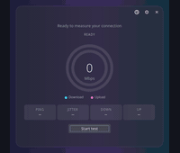</a> |
| **Sonar Sweep**<br><sub>Split</sub> | <a href="docs/media/full/sonar-sweep.gif">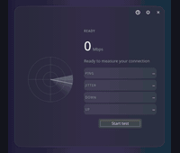</a> | **Cockpit Dial**<br><sub>Center</sub> | <a href="docs/media/full/cockpit-dial.gif">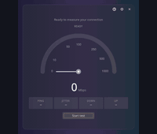</a> |
| **Honeycomb**<br><sub>Center</sub> | <a href="docs/media/full/honeycomb.gif">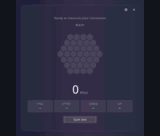</a> | **Data Pipe**<br><sub>Wide</sub> | <a href="docs/media/full/data-pipe.gif">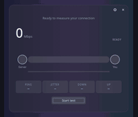</a> |
| **Sunburst**<br><sub>Center</sub> | <a href="docs/media/full/sunburst.gif">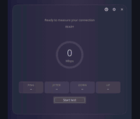</a> | **Dot Matrix**<br><sub>Wide</sub> | <a href="docs/media/full/dot-matrix.gif">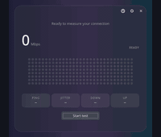</a> |
| **Ripple Pond**<br><sub>Center</sub> | <a href="docs/media/full/ripple-pond.gif">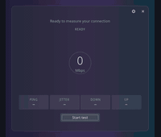</a> | **Column History**<br><sub>Wide</sub> | <a href="docs/media/full/column-history.gif">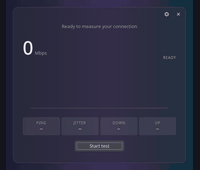</a> |
| **Ribbon Flow**<br><sub>Wide</sub> | <a href="docs/media/full/ribbon-flow.gif">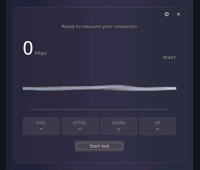</a> | **Rail Arc**<br><sub>Sidebar rail</sub> | <a href="docs/media/full/rail-arc.gif">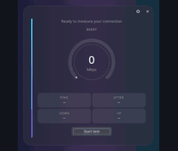</a> |
| **Rail Trace**<br><sub>Sidebar rail</sub> | <a href="docs/media/full/rail-trace.gif">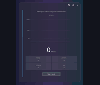</a> | **Rail History**<br><sub>Sidebar rail</sub> | <a href="docs/media/full/rail-history.gif">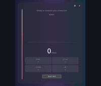</a> |
| **Rail Spectrum**<br><sub>Sidebar rail</sub> | <a href="docs/media/full/rail-spectrum.gif">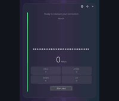</a> | **Rail Wave**<br><sub>Sidebar rail</sub> | <a href="docs/media/full/rail-wave.gif">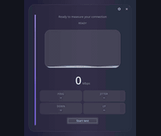</a> |
| **Rail Tach**<br><sub>Sidebar rail</sub> | <a href="docs/media/full/rail-tach.gif">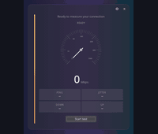</a> | **Dual Arc**<br><sub>Dual stage</sub> | <a href="docs/media/full/dual-arc.gif">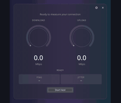</a> |
| **Dual Ring**<br><sub>Dual stage</sub> | <a href="docs/media/full/dual-ring.gif">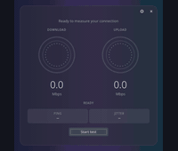</a> | **Dual Orb**<br><sub>Dual stage</sub> | <a href="docs/media/full/dual-orb.gif">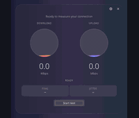</a> |
| **Dual Trace**<br><sub>Dual stage</sub> | <a href="docs/media/full/dual-trace.gif">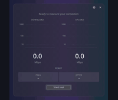</a> | **Dual Spectrum**<br><sub>Dual stage</sub> | <a href="docs/media/full/dual-spectrum.gif">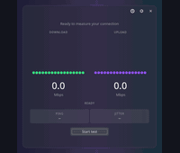</a> |
| **Dual Dial**<br><sub>Dual stage</sub> | <a href="docs/media/full/dual-dial.gif">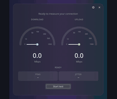</a> | **Quiet Ribbon**<br><sub>Minimal</sub> | <a href="docs/media/full/quiet-ribbon.gif">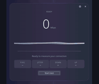</a> |
| **Pulse Spectrum**<br><sub>Minimal</sub> | <a href="docs/media/full/pulse-spectrum.gif">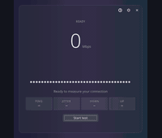</a> |  |  |

## Development

- Tests: `QT_QPA_PLATFORM=offscreen ctest --test-dir build`
- Regenerate the images and GIFs in this file with `tools/media/make-media.py` (needs a built tree, `qml6` and `ffmpeg`). It renders every style offscreen against a scripted demo helper, so it needs no network.
- The design and the implementation plan are in `docs/superpowers/`.
